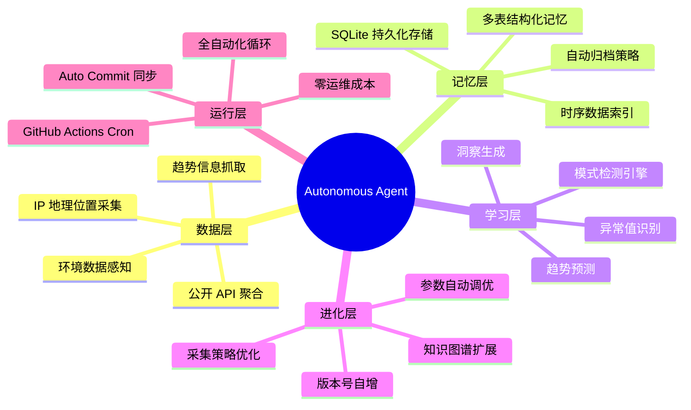
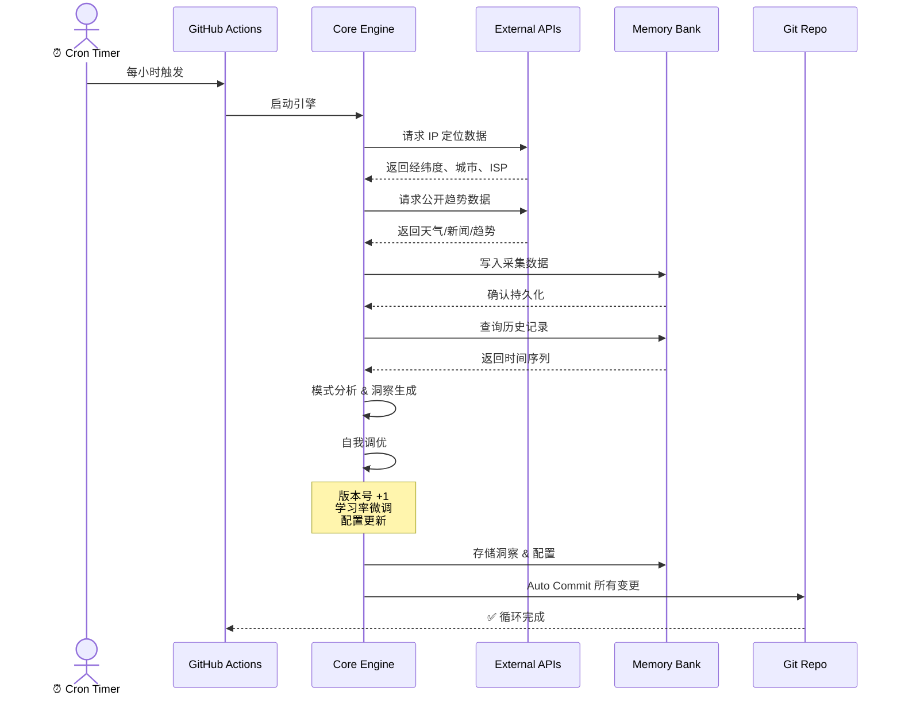
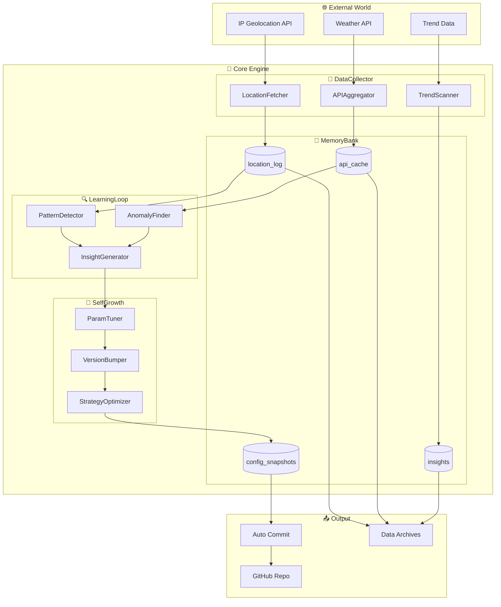
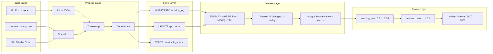
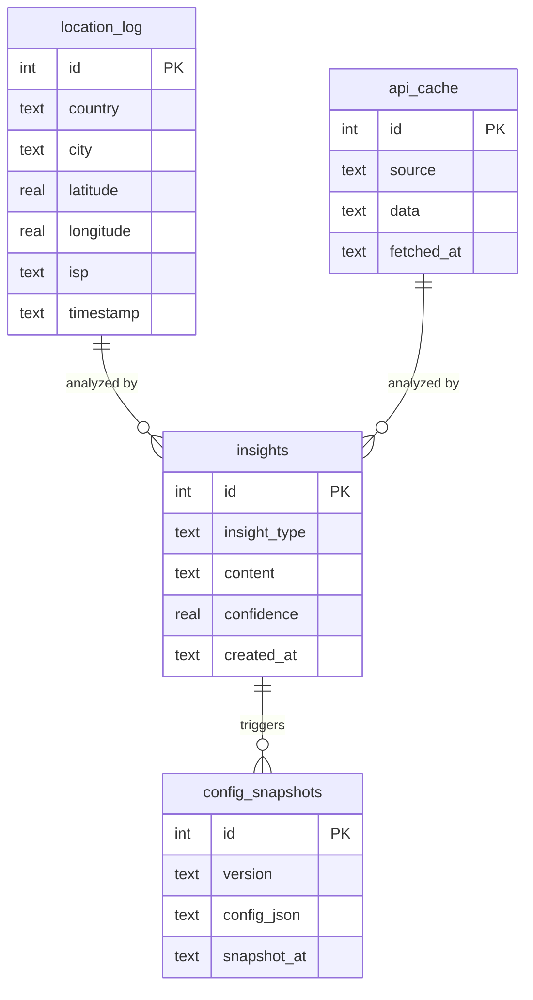
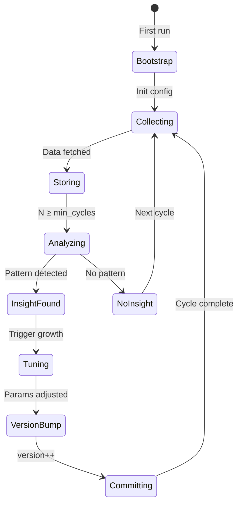

<p align="center">
  
  
  
  
</p>

<br/>

<p align="center">
  <pre style="font-size: 12px; line-height: 1.2; background: #0d1117; color: #58a6ff; padding: 16px; border-radius: 8px; display: inline-block; text-align: left;">
 █████╗ ██╗   ██╗████████╗ ██████╗ ███╗   ██╗ ██████╗ ███╗   ███╗ ██████╗ ██╗   ██╗███████╗
██╔══██╗██║   ██║╚══██╔══╝██╔═══██╗████╗  ██║██╔═══██╗████╗ ████║██╔═══██╗██║   ██║██╔════╝
███████║██║   ██║   ██║   ██║   ██║██╔██╗ ██║██║   ██║██╔████╔██║██║   ██║██║   ██║███████╗
██╔══██║██║   ██║   ██║   ██║   ██║██║╚██╗██║██║   ██║██║╚██╔╝██║██║   ██║██║   ██║╚════██║
██║  ██║╚██████╔╝   ██║   ╚██████╔╝██║ ╚████║╚██████╔╝██║ ╚═╝ ██║╚██████╔╝╚██████╔╝███████║
╚═╝  ╚═╝ ╚═════╝    ╚═╝    ╚═════╝ ╚═╝  ╚═══╝ ╚═════╝ ╚═╝     ╚═╝ ╚═════╝  ╚═════╝ ╚══════╝
  </pre>
</p>

<h1 align="center">🧬 Autonomous Agent</h1>
<p align="center">
  <strong>自循环进化智能体</strong> · <em>A Self-Growing, Self-Evolving AI Agent That Never Sleeps</em>
</p>

<p align="center">
  <a href="#-中文文档">🇨🇳 中文</a> ·
  <a href="#-english-documentation">🌐 English</a> ·
  <a href="#-architecture-deep-dive">🏗️ Architecture</a> ·
  <a href="#-quick-start">🚀 Quick Start</a> ·
  <a href="#-api-reference">📖 API</a> ·
  <a href="#-faq">❓ FAQ</a>
</p>

---

## 📑 Table of Contents

- [中文文档](#-中文文档)
  - [项目简介](#-项目简介)
  - [为什么需要它](#-为什么需要它)
  - [核心特性](#-核心特性)
  - [运行流程](#-运行流程)
  - [系统架构](#-系统架构)
  - [数据流图](#-数据流图)
  - [快速开始](#-快速开始)
  - [配置说明](#-配置说明)
  - [项目结构](#-项目结构)
- [English Documentation](#-english-documentation)
  - [Overview](#-overview)
  - [Why This Exists](#-why-this-exists)
  - [Core Features](#-core-features)
  - [Quick Start](#-quick-start-1)
  - [Project Structure](#-project-structure-1)
- [Advanced](#-advanced)
  - [Architecture Deep Dive](#-architecture-deep-dive)
  - [API Reference](#-api-reference)
  - [Roadmap](#-roadmap)
  - [FAQ](#-faq)
  - [Contributing](#-contributing)
  - [License](#-license)

---

# 🇨🇳 中文文档

## 📖 项目简介

**Autonomous Agent** 是一个完全自主运行、自我进化的 AI 智能体系统。

它**不依赖本地服务器**——整个生命周期托管在 **GitHub Actions** 云端。每隔一小时，它会自动唤醒，从互联网采集真实世界数据，将知识持久化到 SQLite 记忆银行中，通过模式分析生成洞察，并根据分析结果**自动调整自身参数**——版本号递增、学习率微调、采集策略优化，全部由代码自动完成。

> **核心理念**: 一个不需要人类干预、自己会"成长"的 AI 智能体。

### 与传统 Agent 的对比

| 维度 | 传统 Agent | Autonomous Agent |
|------|-----------|-----------------|
| 运行环境 | 需要本地服务器/云主机 | GitHub Actions 免费托管 |
| 触发方式 | 手动调用 / API 触发 | Cron 定时器全自动 |
| 数据存储 | 外部数据库 | 内置 SQLite + Git 持久化 |
| 自我进化 | ❌ 参数固定 | ✅ 自动调参、版本递增 |
| 运维成本 | 需要维护服务器 | 零运维 |
| 状态同步 | 需手动备份 | Git Commit 自动同步 |

---

## 🎯 为什么需要它？

<details>
<summary><b>展开阅读：设计动机与使用场景</b></summary>

### 场景一：24/7 环境监控

Agent 每小时采集一次地理位置、天气、公开趋势数据，持续积累形成数据资产。几个月后，你拥有了一份完整的时间序列数据集，可自由回溯分析。

### 场景二：AI 自我进化实验

观察一个 AI 系统在没有人类干预的情况下如何自我优化——学习率变化、采集频率调整、知识图谱扩展，全程由系统自主决策。

### 场景三：个人数据银行

所有数据存储在你的 GitHub 仓库中，完全归你所有。SQLite 数据库 + JSON 档案双格式存储，随时可用其他工具分析。

### 场景四：学习 AI Agent 架构

从零理解一个完整 Agent 的运作机制——数据采集 → 记忆存储 → 模式学习 → 自我优化，代码结构清晰，模块解耦。

</details>

---

## ✨ 核心特性



---

## 🔄 运行流程



---

## 🏗 系统架构



---

## 📊 数据流图



---

## 🚀 快速开始

### 前置条件

- [Python 3.9+](https://www.python.org/downloads/)
- [Git](https://git-scm.com/)
- 一个 GitHub 账号

### 方式一：直接 Fork（推荐）

```bash
# 1. Fork 仓库
# 在 GitHub 页面点击 Fork 按钮

# 2. 克隆到本地
git clone https://github.com/YOUR_USERNAME/autonomous-agent.git
cd autonomous-agent

# 3. 推送即生效
# GitHub Actions 会自动开始每小时运行
```

### 方式二：从零部署

```bash
# 1. 克隆仓库
git clone https://github.com/jincheng3870682453-hash/autonomous-agent.git
cd autonomous-agent

# 2. 修改远程地址
git remote set-url origin https://github.com/YOUR_USERNAME/autonomous-agent.git

# 3. 安装依赖（可选，仅本地测试需要）
pip install -r requirements.txt

# 4. 本地测试
python src/engine.py

# 5. 推送
git push -u origin main
```

### 手动触发运行

```
GitHub 仓库页面 → Actions → Autonomous Agent Cycle → Run workflow
```

---

## ⚙️ 配置说明

<details>
<summary><b>展开查看 config.json 完整配置项</b></summary>

```json
{
  "version": "1.0.0",
  "cycle_interval": 3600,
  "data_sources": {
    "ip_geolocation": {
      "enabled": true,
      "provider": "ip-api.com",
      "fields": ["country", "city", "lat", "lon", "isp", "org"]
    },
    "weather": {
      "enabled": false,
      "note": "Reserved for future API integration"
    },
    "trends": {
      "enabled": false,
      "note": "Reserved for future integration"
    }
  },
  "learning": {
    "learning_rate": 0.5,
    "min_cycles_for_insight": 3,
    "anomaly_threshold": 2.0
  },
  "memory": {
    "max_records_per_table": 10000,
    "auto_archive_cycles": 100
  },
  "self_growth": {
    "auto_tune": true,
    "learning_rate_step": 0.05,
    "max_learning_rate": 1.0
  }
}
```

</details>

---

## 📂 项目结构

```
autonomous-agent/
│
├── src/
│   └── engine.py                    # 🔥 核心引擎 (~350 行)
│       ├── class MemoryBank         #    SQLite 记忆银行
│       ├── class DataCollector      #    多源数据采集
│       ├── class LearningLoop       #    模式学习 & 洞察
│       └── class SelfGrowth         #    参数自进化
│
├── memory/
│   └── memory.db                    # 💾 持久化知识库
│       ├── location_log             #    地理位置时间序列
│       ├── api_cache                #    API 响应缓存
│       ├── insights                 #    洞察记录
│       └── config_snapshots         #    配置快照历史
│
├── data/
│   └── cycle_*.json                 # 📦 每次循环的数据存档
│
├── .github/
│   └── workflows/
│       └── agent-cycle.yml          # ⏰ 云端 Cron 调度
│
├── scripts/
│   └── install.py                   # 🔧 Skill 安装脚本
│
├── config.json                      # ⚙️ 自我进化的配置
├── requirements.txt                 # 📋 Python 依赖
├── LICENSE                          # 📜 MIT 许可证
└── README.md                        # 📖 本文档
```

---

# 🌐 English Documentation

## 📖 Overview

**Autonomous Agent** is a fully self-running, self-evolving AI agent system.

It does **not** require a local server — the entire lifecycle is hosted on **GitHub Actions**. Every hour, it wakes autonomously, collects real-world data from the internet, persists knowledge into an SQLite memory bank, analyzes patterns to generate insights, and **auto-tunes its own parameters** — version bumps, learning rate adjustments, and collection strategy optimizations — all done by code without human intervention.

> **Core philosophy**: An AI agent that grows by itself, no human needed.

### Comparison with Traditional Agents

| Dimension | Traditional Agent | Autonomous Agent |
|-----------|-------------------|------------------|
| Runtime | Local server / VPS | GitHub Actions (free) |
| Trigger | Manual / API call | Cron timer (auto) |
| Storage | External database | Built-in SQLite + Git |
| Self-evolution | ❌ Fixed params | ✅ Auto-tune & version bump |
| Ops cost | Server maintenance | Zero ops |
| State sync | Manual backup | Auto Git commit |

---

## 🎯 Why This Exists?

<details>
<summary><b>Click to expand: Design motivation & use cases</b></summary>

### Use Case 1: 24/7 Environmental Monitoring

The Agent collects geolocation, weather, and public trend data every hour, building a continuous data asset over time. After months, you have a complete time-series dataset ready for retrospective analysis.

### Use Case 2: AI Self-Evolution Experiment

Observe how an AI system self-optimizes without human intervention — learning rate changes, collection frequency adjustments, knowledge graph expansion — all autonomously decided.

### Use Case 3: Personal Data Bank

All data lives in your GitHub repository — fully owned by you. SQLite + JSON dual-format storage, ready for analysis with any tool.

### Use Case 4: Learning AI Agent Architecture

Understand the complete Agent lifecycle from scratch: Data Collection → Memory Storage → Pattern Learning → Self-Optimization. Clean, decoupled code structure.

</details>

---

## ✨ Core Features

| # | Module | Capability | Tech Stack |
|---|--------|-----------|------------|
| 1 | 📡 **DataCollector** | IP geolocation, public APIs, environment sensing | `requests`, REST APIs |
| 2 | 🧠 **MemoryBank** | Persistent SQLite, multi-table, time-indexed | `sqlite3`, JSON |
| 3 | 🔍 **LearningLoop** | Pattern detection, anomaly finding, insight generation | Python analytics |
| 4 | 🌱 **SelfGrowth** | Auto param tuning, version bump, strategy optimization | Config-driven |
| 5 | 🔄 **AutoCycle** | GitHub Actions cron, zero human ops | GitHub Actions |
| 6 | 📝 **AutoCommit** | Every change committed back to repo | `git` automation |

---

## 🚀 Quick Start

### Prerequisites

- Python 3.9+
- Git
- A GitHub account

### Option 1: Fork (Recommended)

```bash
# 1. Click Fork on GitHub
# 2. Clone your fork
git clone https://github.com/YOUR_USERNAME/autonomous-agent.git
cd autonomous-agent
# 3. Done! GitHub Actions takes over automatically.
```

### Option 2: From Scratch

```bash
git clone https://github.com/jincheng3870682453-hash/autonomous-agent.git
cd autonomous-agent
git remote set-url origin https://github.com/YOUR_USERNAME/autonomous-agent.git
pip install -r requirements.txt
python src/engine.py          # local test
git push -u origin main       # deploy to cloud
```

### Manual Trigger

```
GitHub Repo → Actions → Autonomous Agent Cycle → Run workflow
```

---

## 📂 Project Structure

```
autonomous-agent/
├── src/engine.py                 ← 🔥 Core engine (memory, learning, growth)
├── memory/memory.db              ← 💾 Persistent knowledge base (auto-growing)
├── data/cycle_*.json             ← 📦 Cycle data archives
├── .github/workflows/            ← ⏰ Cloud cron scheduler
├── scripts/install.py            ← 🔧 Skill installer
├── config.json                   ← ⚙️ Self-evolving config
├── requirements.txt
└── LICENSE
```

---

# 🔬 Advanced

## 🏗 Architecture Deep Dive

### Module Interaction

```mermaid
graph TD
    A[GitHub Actions Cron] -->|trigger| B[main()]
    B -->|init| C[MemoryBank]
    B -->|init| D[DataCollector]
    B -->|init| E[LearningLoop]
    B -->|init| F[SelfGrowth]

    D -->|fetch_location| G[ip-api.com]
    D -->|fetch_public_data| H[Public APIs]
    
    G -->|store| C
    H -->|store| C
    
    C -->|get_history| E
    E -->|analyze| I[Pattern Detection]
    E -->|analyze| J[Anomaly Detection]
    I -->|generate| K[Insight]
    J -->|generate| K
    
    K -->|feed| F
    F -->|tune| L[config.json]
    F -->|bump| M[version++]
    
    L -->|commit| N[Git Push]
    M -->|commit| N
```

### Memory Schema



### Self-Growth Lifecycle



---

## 📖 API Reference

### Engine API

```python
from src.engine import AutonomousAgent, MemoryBank, DataCollector, LearningLoop, SelfGrowth

# Initialize
agent = AutonomousAgent()

# Manual run
agent.run()

# Access modules
agent.memory    # MemoryBank instance
agent.collector # DataCollector instance
agent.learner   # LearningLoop instance
agent.growth    # SelfGrowth instance
```

### MemoryBank

```python
# Store data
memory.insert("location_log", {
    "country": "China",
    "city": "Hangzhou",
    "latitude": 30.25,
    "longitude": 120.16,
    "isp": "Alibaba Cloud"
})

# Query history
records = memory.query(
    "SELECT * FROM location_log WHERE timestamp > ?",
    ("2025-07-01",)
)
```

### DataCollector

```python
# Fetch IP geolocation
location = collector.fetch_ip_location()
# Returns: {"country": "China", "city": "Hangzhou", ...}

# Fetch public data (extensible)
data = collector.fetch_public_data()
# Returns: {"weather": {...}, "trends": [...]}
```

### LearningLoop

```python
# Analyze historical data
insights = learner.analyze(memory)
# Returns: [{"type": "pattern", "content": "...", "confidence": 0.8}]

# Generate insights
insight = learner.generate_insight(patterns)
```

### SelfGrowth

```python
# Apply growth based on insights
growth.apply(insights, config)

# Auto-tune parameters
growth.auto_tune(config)

# Version bump
growth.bump_version(config)
```

---

## 🗺 Roadmap

| Phase | Milestone | Status |
|-------|-----------|--------|
| 🟢 **v1.0** | Core engine, hourly cycle, IP geolocation, SQLite memory | ✅ Done |
| 🟡 **v1.1** | Weather API integration, multi-source data fusion | 🚧 In Progress |
| 🟡 **v1.2** | Trend data collection (news, social media signals) | 📋 Planned |
| 🔵 **v2.0** | LLM-powered insight generation, natural language reports | 📋 Planned |
| 🔵 **v2.1** | Web dashboard for memory visualization | 📋 Planned |
| 🔵 **v3.0** | Multi-agent collaboration, agent-to-agent communication | 📋 Planned |

---

## ❓ FAQ

<details>
<summary><b>Q: 真的不需要任何服务器吗？</b></summary>

**A**: 对。GitHub Actions 为公开仓库提供免费的运行额度（2000 分钟/月）。Agent 每小时运行约 10-30 秒，每月消耗约 120-360 分钟，远低于免费额度。
</details>

<details>
<summary><b>Q: 数据安全吗？</b></summary>

**A**: 所有数据存储在你的 GitHub 仓库中。如果你选择 Private 仓库，数据对外不可见。Agent 不向任何第三方服务器发送你的数据。
</details>

<details>
<summary><b>Q: 能改成每 5 分钟运行一次吗？</b></summary>

**A**: 可以。修改 `.github/workflows/agent-cycle.yml` 中的 `cron: '0 * * * *'` 为 `cron: '*/5 * * * *'`。但注意 GitHub Actions 的最小间隔是 5 分钟。
</details>

<details>
<summary><b>Q: 如何添加新的数据源？</b></summary>

**A**: 在 `src/engine.py` 的 `DataCollector` 类中添加新方法，然后在 `config.json` 中启用即可。参考现有的 `fetch_ip_location()` 实现。
</details>

<details>
<summary><b>Q: Does it really need zero servers?</b></summary>

**A**: Yes. GitHub Actions provides 2,000 free minutes/month for public repos. The agent runs ~10-30 seconds per cycle, consuming ~120-360 minutes/month — well within free tier limits.
</details>

<details>
<summary><b>Q: Is my data safe?</b></summary>

**A**: All data lives in your GitHub repository. Use a Private repo for total privacy. The agent sends no data to any third-party server except the public APIs it queries.
</details>

<details>
<summary><b>Q: Can I change the interval?</b></summary>

**A**: Yes. Edit `cron` in `.github/workflows/agent-cycle.yml`. Minimum interval is 5 minutes (GitHub Actions limit).
</details>

<details>
<summary><b>Q: How do I add new data sources?</b></summary>

**A**: Add a new method to the `DataCollector` class in `src/engine.py`, then enable it in `config.json`. Follow the `fetch_ip_location()` pattern.
</details>

---

## 🤝 Contributing

Contributions welcome! Here's how:

1. **Fork** the repository
2. **Create** a feature branch: `git checkout -b feat/amazing-feature`
3. **Commit** your changes: `git commit -m 'Add amazing feature'`
4. **Push**: `git push origin feat/amazing-feature`
5. **Open** a Pull Request

Areas where contributions are especially valuable:
- New data source integrations (weather, stocks, news APIs)
- Learning algorithm improvements
- Dashboard/visualization
- Documentation translations

---

## 📜 License

MIT © 2025 [Jincheng3870682453-hash](https://github.com/jincheng3870682453-hash)

Permission is hereby granted, free of charge, to any person obtaining a copy of this software and associated documentation files, to deal in the Software without restriction, including without limitation the rights to use, copy, modify, merge, publish, distribute, sublicense, and/or sell copies of the Software.

---

<p align="center">
  <sub>
    🧬 Built for autonomous evolution ·
    <a href="https://github.com/jincheng3870682453-hash/autonomous-agent">GitHub</a> ·
    <a href="#-faq">FAQ</a> ·
    <a href="#-api-reference">API</a>
  </sub>
</p>

<br/>

<p align="center">
  
  
</p>
