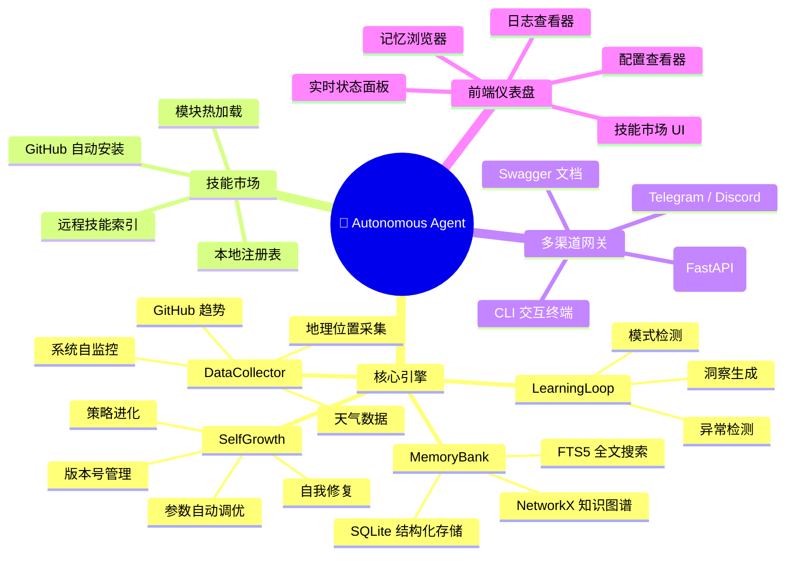
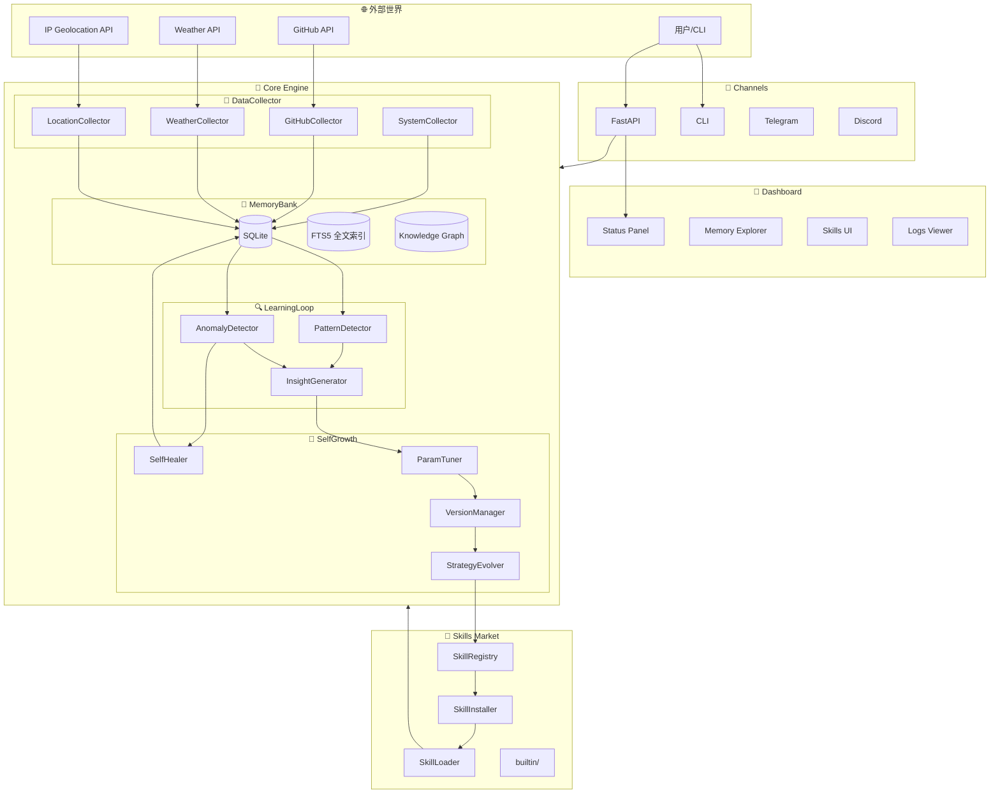
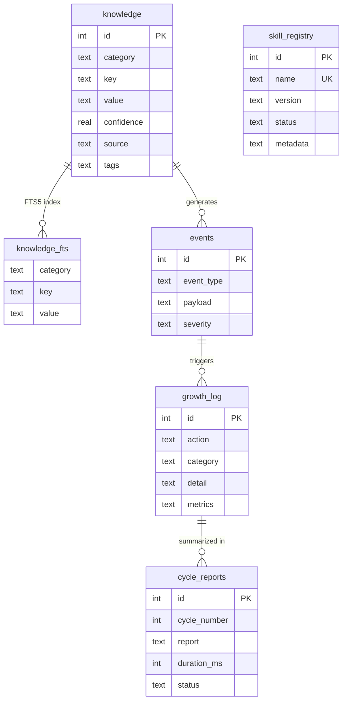
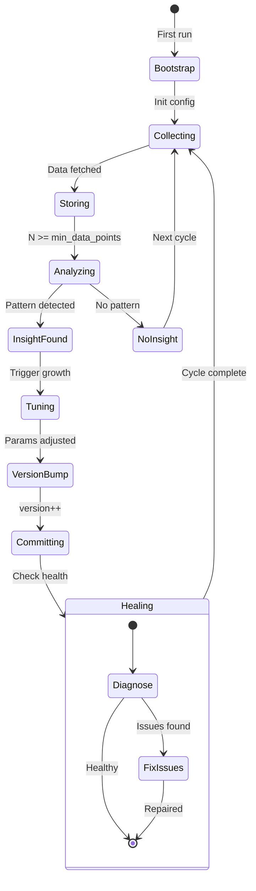
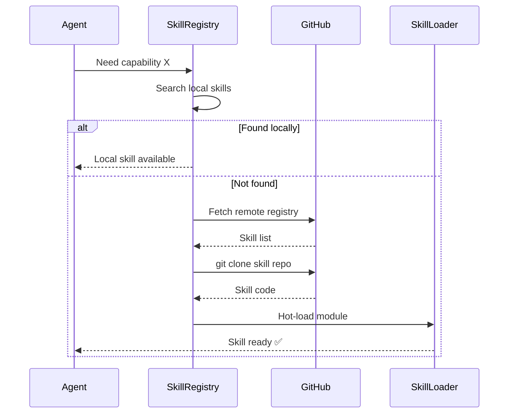

<p align="center">
  
  
  
  
  
</p>

<br/>

<p align="center">
  <pre style="font-size: 11px; line-height: 1.1; background: #0d1117; color: #58a6ff; padding: 12px; border-radius: 8px; display: inline-block; text-align: left;">
 █████╗ ██╗   ██╗████████╗ ██████╗ ███╗   ██╗ ██████╗ ███╗   ███╗ ██████╗ ██╗   ██╗███████╗
██╔══██╗██║   ██║╚══██╔══╝██╔═══██╗████╗  ██║██╔═══██╗████╗ ████║██╔═══██╗██║   ██║██╔════╝
███████║██║   ██║   ██║   ██║   ██║██╔██╗ ██║██║   ██║██╔████╔██║██║   ██║██║   ██║███████╗
██╔══██║██║   ██║   ██║   ██║   ██║██║╚██╗██║██║   ██║██║╚██╔╝██║██║   ██║██║   ██║╚════██║
██║  ██║╚██████╔╝   ██║   ╚██████╔╝██║ ╚████║╚██████╔╝██║ ╚═╝ ██║╚██████╔╝╚██████╔╝███████║
╚═╝  ╚═╝ ╚═════╝    ╚═╝    ╚═════╝ ╚═╝  ╚═══╝ ╚═════╝ ╚═╝     ╚═╝ ╚═════╝  ╚═════╝ ╚══════╝
  </pre>
</p>

<h1 align="center">🧬 Autonomous Agent</h1>
<p align="center">
  <strong>模块化自循环进化智能体平台</strong><br/>
  <em>A Modular, Self-Growing, Self-Evolving AI Agent Platform</em>
</p>

<p align="center">
  <a href="#-中文文档">🇨🇳 中文</a> ·
  <a href="#-english">🌐 English</a> ·
  <a href="#-architecture">🏗 Architecture</a> ·
  <a href="#-quick-start">🚀 Quick Start</a> ·
  <a href="#-api">📖 API</a> ·
  <a href="#-faq">❓ FAQ</a>
</p>

---

# 🇨🇳 中文文档

## 📖 项目简介

**Autonomous Agent** 是一个**平台级**的自主进化 AI 智能体系统。

它采用**全模块化、可插拔**架构——记忆系统、数据采集、学习引擎、自我增长、技能市场、多渠道网关、前端仪表盘——每个模块独立运行、可按需组合。Agent 运行在 **GitHub Actions** 云端，每小时自动唤醒，采集真实世界数据，构建三层记忆（SQLite + FTS5 全文搜索 + 知识图谱），通过模式检测和异常分析生成洞察，并**自行调整参数、递增版本、甚至从 GitHub 拉取安装新技能**。

> **核心理念**: 一个会自己装插件、自己修 bug、自己长本事的 AI 平台。

### 🆚 与传统 Agent 对比

| 维度 | 传统 Agent | Autonomous Agent |
|------|-----------|-----------------|
| 运行环境 | 本地服务器/VPS | GitHub Actions 免费 |
| 架构 | 单体脚本 | **模块化、可插拔** |
| 触发 | 手动/API | Cron 全自动 |
| 记忆 | 无/简单变量 | **SQLite + FTS5 + 知识图谱** |
| 进化 | ❌ 固定参数 | **自动调参 + 版本管理 + 自我修复** |
| 扩展 | 改代码 | **技能市场、GitHub 拉取安装** |
| 前端 | ❌ 无 | **Dashboard + API 文档** |
| 渠道 | 单一 | **CLI + API + Telegram + Discord** |
| 运维 | 需维护 | **零运维、Auto Commit** |

---

## ✨ 核心特性



---

## 🏗 架构图



---

## 🚀 快速开始

### 前置条件
- Python 3.9+
- Git
- GitHub 账号

### 一键 Fork 部署

```bash
# 1. Fork 仓库（GitHub 页面点击 Fork）

# 2. 克隆
git clone https://github.com/YOUR_USERNAME/autonomous-agent.git
cd autonomous-agent

# 3. 安装依赖
pip install -r requirements.txt

# 4. 本地测试
python run.py cycle      # 运行一个循环
python run.py cli        # 交互式终端
python run.py api        # 启动 API + Dashboard
python run.py status     # 查看状态

# 5. 推送到 GitHub → 云端自动运行
git push origin main
```

### 四种运行模式

```bash
# Cloud 模式（GitHub Actions 自动调用）
python run.py cycle

# API 模式（本地服务器 + Dashboard）
python run.py api
# 访问: http://localhost:8000/dashboard
# API 文档: http://localhost:8000/docs

# CLI 模式（交互终端）
python run.py cli

# Status 模式（查看状态）
python run.py status
```

### Dashboard 预览

启动 API 后访问 `http://localhost:8000/dashboard`：

- **Dashboard** — 实时状态、知识类别图表、最近循环
- **Memory** — 全文搜索浏览所有记忆
- **Skills Market** — 浏览和安装技能
- **Logs** — 增长历史日志
- **Configuration** — 查看当前配置
- **API Docs** — Swagger/ReDoc 交互文档

---

## 📂 项目结构

```
autonomous-agent/
│
├── core/                              # 🔥 核心引擎
│   ├── agent.py                       #    主控制器（生命周期管理）
│   ├── memory/
│   │   └── bank.py                    #    记忆银行（SQLite+FTS5+Graph）
│   ├── collector/
│   │   └── __init__.py                #    数据采集器（多源可插拔）
│   ├── learner/
│   │   └── __init__.py                #    学习循环（模式+异常+洞察）
│   ├── growth/
│   │   └── __init__.py                #    自我增长（调参+版本+修复）
│   └── channel/
│       └── __init__.py                #    多渠道网关（CLI/API/IM）
│
├── skills/                            # 🧩 技能市场系统
│   ├── __init__.py                    #    SkillManager（注册+安装+加载）
│   ├── registry.json                  #    技能注册表（本地+远程）
│   └── builtin/                       #    内置技能
│       ├── system_status.py
│       └── data_export.py
│
├── api/
│   └── server.py                      # 🌐 FastAPI 服务器（REST API）
│
├── frontend/                          # 🎨 仪表盘（纯 HTML/CSS/JS）
│   ├── index.html
│   ├── css/style.css
│   └── js/
│       ├── app.js                     #    核心 & 导航
│       ├── dashboard.js               #    仪表盘
│       ├── memory.js                  #    记忆浏览器
│       ├── skills.js                  #    技能市场
│       ├── logs.js                    #    日志查看器
│       └── config.js                  #    配置查看器
│
├── run.py                             # 🚀 统一入口
├── config.yaml                        # ⚙️ YAML 配置
├── agent.json                         # 💫 Agent 灵魂文件
├── requirements.txt                   # 📦 依赖
├── .github/workflows/agent-cycle.yml  # ⏰ 云端 Cron
├── LICENSE                            # 📜 MIT
└── README.md
```

---

# 🌐 English Documentation

## 📖 Overview

**Autonomous Agent** is a **platform-level**, modular, self-evolving AI agent system.

It features a **fully modular, pluggable architecture** — memory system, data collectors, learning engine, self-growth, skill marketplace, multi-channel gateway, and web dashboard — each module runs independently and can be composed as needed. The Agent runs on **GitHub Actions** in the cloud, waking every hour to collect real-world data, building a three-layer memory (SQLite + FTS5 full-text search + Knowledge Graph), generating insights through pattern detection and anomaly analysis, and **auto-tuning parameters, incrementing versions, even pulling and installing new skills from GitHub**.

> **Core Philosophy**: An AI platform that installs its own plugins, fixes its own bugs, and grows its own capabilities.

## ✨ Core Features

| # | Module | Capability | Tech |
|---|--------|-----------|------|
| 1 | 🧠 **MemoryBank** | SQLite + FTS5 + Knowledge Graph | sqlite3, networkx |
| 2 | 📡 **DataCollector** | Multi-source (geo, weather, github, system) | Pluggable collectors |
| 3 | 🔍 **LearningLoop** | Pattern + Anomaly detection, Insight generation | Statistical analysis |
| 4 | 🌱 **SelfGrowth** | Auto-tuning, version mgmt, self-healing | Config-driven |
| 5 | 🧩 **Skills Market** | Registry, installer, hot-reload from GitHub | Dynamic import |
| 6 | 📡 **Channels** | CLI + FastAPI + Telegram + Discord | Multi-gateway |
| 7 | 🎨 **Dashboard** | Real-time status, memory explorer, skills UI | Vanilla JS SPA |
| 8 | 🔄 **Auto Cycle** | GitHub Actions cron, zero ops | CI/CD |

## 🚀 Quick Start

```bash
git clone https://github.com/YOUR_USERNAME/autonomous-agent.git
cd autonomous-agent
pip install -r requirements.txt

python run.py cycle    # Single cycle
python run.py api      # API + Dashboard (port 8000)
python run.py cli      # Interactive CLI
python run.py status   # View status
```

---

# 🔬 Advanced

## 🏗 Architecture Deep Dive

### Memory Schema



### Self-Growth Lifecycle



### Skill Lifecycle



---

## 📖 API Reference

### Run a Cycle
```http
POST /api/cycle
```
### Get Status
```http
GET /api/status
```
### Search Memory
```http
POST /api/memory/search
Content-Type: application/json
{"query": "keyword", "limit": 20}
```
### Install Skill
```http
POST /api/skills/install
Content-Type: application/json
{"name_or_url": "weather_analyzer"}
```
### Full API Docs
`http://localhost:8000/docs` (Swagger) | `http://localhost:8000/redoc` (ReDoc)

---

## 🗺 Roadmap

| Phase | Milestone | Status |
|-------|-----------|--------|
| 🟢 **v1.0** | Core engine, modular architecture, FTS5+Graph memory, API+Dashboard | ✅ Done |
| 🟡 **v1.1** | LLM-powered insights (OpenAI/Claude), natural language reports | 📋 Planned |
| 🟡 **v1.2** | Telegram/Discord bot channels, webhook triggers | 📋 Planned |
| 🔵 **v2.0** | Multi-agent fleet, agent-to-agent collaboration | 📋 Planned |
| 🔵 **v2.1** | Vector database (Chroma/Qdrant), RAG memory retrieval | 📋 Planned |
| 🔵 **v3.0** | Self-modifying code, skill auto-generation | 📋 Planned |

---

## ❓ FAQ

<details>
<summary><b>Q: 真的零运维吗？</b></summary>
**A**: 是的。GitHub Actions 免费额度（2000 分钟/月）足够每小时运行。Agent 自动 commit、自动 push，所有状态同步回仓库。Fork → Push → Forget。
</details>

<details>
<summary><b>Q: 如何添加新的数据采集源？</b></summary>
**A**: 继承 `BaseCollector` 类，实现 `collect()` 方法，在 `config.yaml` 中启用即可。完全可插拔，无需修改核心代码。
</details>

<details>
<summary><b>Q: 技能市场怎么用？</b></summary>
**A**: Agent 可以自动从 GitHub 拉取技能模块。Dashboard 中点击 "Install" 或调用 API `POST /api/skills/install`。安装后模块热加载，无需重启。
</details>

<details>
<summary><b>Q: 数据安全吗？</b></summary>
**A**: 所有数据存储在你的 GitHub 仓库中。使用 Private 仓库可完全保护隐私。Agent 不向第三方发送你的数据（除公开 API 查询外）。
</details>

---

## 📜 License

MIT © 2025 [Jincheng3870682453-hash](https://github.com/jincheng3870682453-hash)

---

<p align="center">
  <sub>🧬 Built for autonomous evolution · Modular · Pluggable · Self-Growing</sub>
</p>

<br/>

<p align="center">
  
  
</p>
