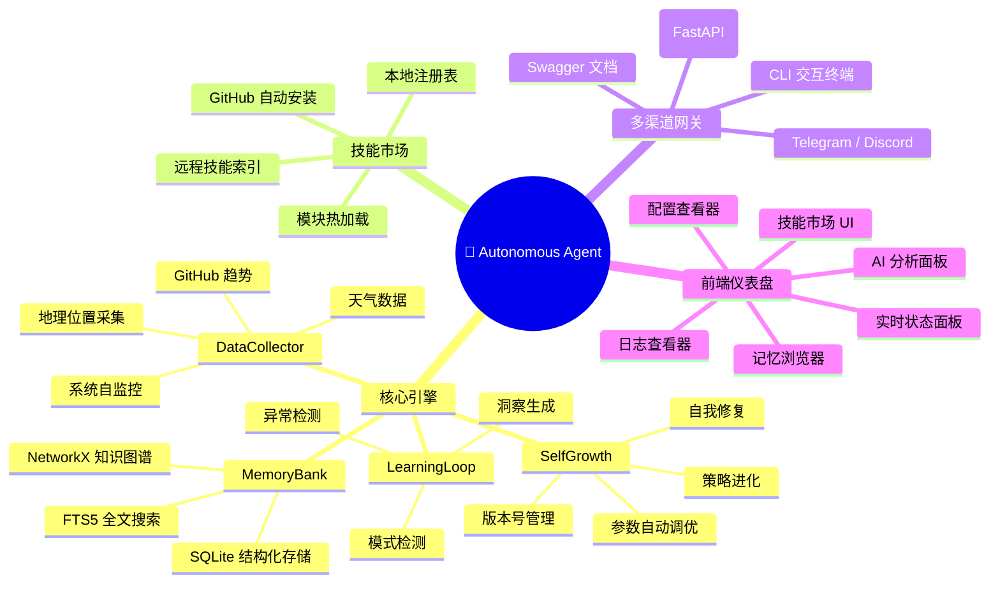
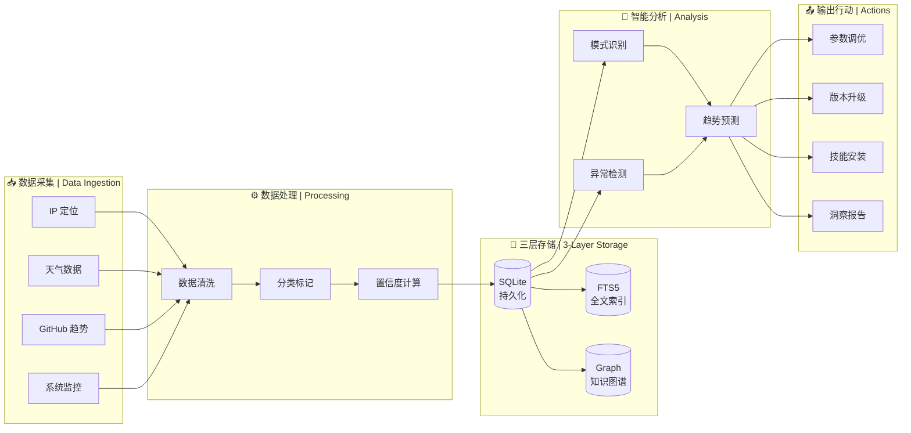
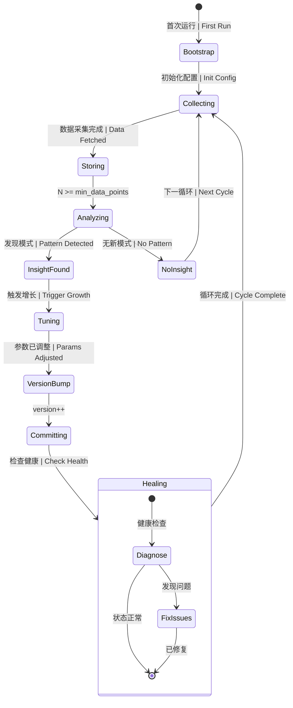
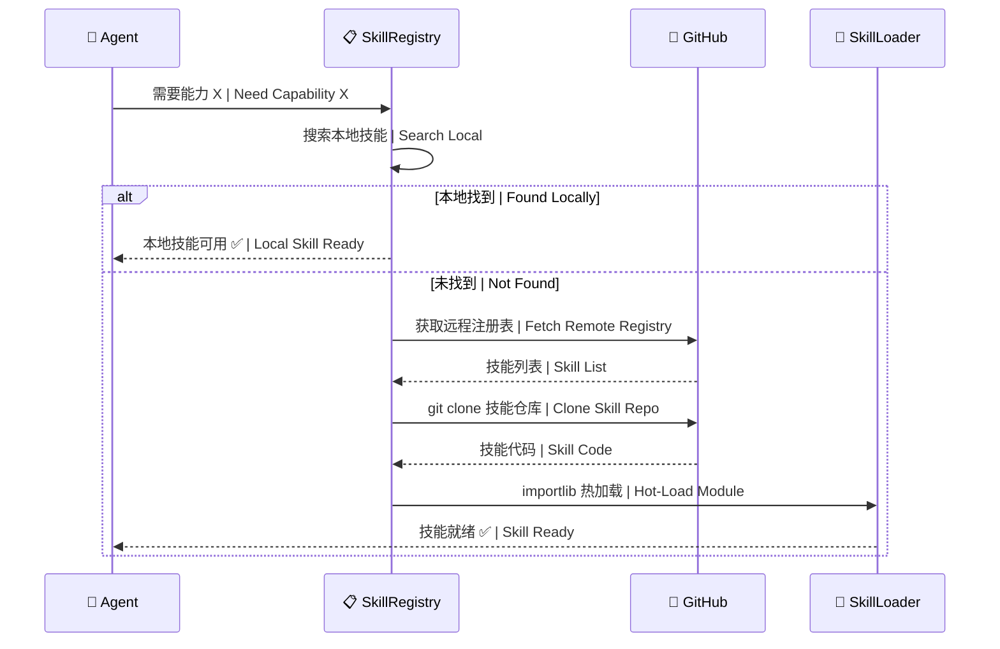

<p align="center">
  
  
  
  
  
  
</p>

<br/>

<p align="center">
  <pre style="font-size: 11px; line-height: 1.1; background: #0d1117; color: #58a6ff; padding: 12px; border-radius: 8px; display: inline-block; text-align: left;">
 █████╗ ██╗   ██╗████████╗ ██████╗ ███╗   ██╗ ██████╗ ███╗   ███╗ ██████╗ ██╗   ██╗███████╗
██╔══██╗██║   ██║╚══██╔══╝██╔═══██╗████╗  ██║██╔═══██╗████╗ ████║██╔═══██╗██║   ██║██╔════╝
███████║██║   ██║   ██║   ██║   ██║██╔██╗ ██║██║   ██║██╔████╔██║██║   ██║██║   ██║███████╗
██╔══██║██║   ██║   ██║   ██║   ██║██║╚██╗██║██║   ██║██║╚██╔╝██║██║   ██║██║   ██║╚════██║
██║  ██║╚██████╔╝   ██║   ╚██████╔╝██║ ╚████║╚██████╔╝██║ ╚═╝ ██║╚██████╔╝╚██████╔╝███████║
╚═╝  ╚═╝ ╚═════╝    ╚═╝    ╚═════╝ ╚═╝  ╚═══╝ ╚═════╝ ╚═╝     ╚═╝ ╚═════╝  ╚═════╝ ╚══════╝
  </pre>
</p>

<h1 align="center">🧬 Autonomous Agent</h1>

<p align="center">
  <strong>模块化自循环进化智能体平台</strong><br/>
  <em>A Modular, Self-Growing, Self-Evolving AI Agent Platform</em>
</p>

<p align="center">
  <a href="#-中文文档">🇨🇳 中文</a> ·
  <a href="#-english-documentation">🌐 English</a> ·
  <a href="#-系统架构-system-architecture">🏗 Architecture</a> ·
  <a href="#-快速开始-quick-start">🚀 Quick Start</a> ·
  <a href="#-api-参考-api-reference">📖 API</a> ·
  <a href="#-faq">❓ FAQ</a>
</p>

<p align="center">
  <a href="https://github.com/jincheng3870682453-hash/autonomous-agent">
    
  </a>
  <a href="https://github.com/jincheng3870682453-hash/autonomous-agent">
    
  </a>
</p>

---

## 📑 目录 | Table of Contents

- [🇨🇳 中文文档](#-中文文档)
  - [📖 项目简介](#-项目简介)
  - [💡 为什么选择 Autonomous Agent？](#-为什么选择-autonomous-agent)
  - [✨ 核心特性](#-核心特性)
  - [🆚 与传统 Agent / 主流框架对比](#-与传统-agent--主流框架对比)
  - [🏗 系统架构](#-系统架构-system-architecture)
  - [📂 项目结构](#-项目结构)
  - [🚀 快速开始](#-快速开始-quick-start)
  - [📖 API 参考](#-api-参考-api-reference)
  - [🖥 Dashboard 预览](#-dashboard-预览)
  - [🗺 路线图](#-路线图)
  - [❓ FAQ](#-faq)
- [🌐 English Documentation](#-english-documentation)
  - [📖 Overview](#-overview)
  - [✨ Key Features](#-key-features)
  - [🏗 Architecture](#-architecture)
  - [🚀 Quick Start](#-quick-start-1)
  - [📖 API Reference](#-api-reference)
- [📜 License](#-license)

---

# 🇨🇳 中文文档

## 📖 项目简介

> **Autonomous Agent** 是一个**平台级**的自主进化 AI 智能体系统——它会自己采集数据、自己学习、自己调参、自己装插件、自己修 bug。

采用**全模块化、可插拔**架构：记忆系统、数据采集、学习引擎、自我增长、技能市场、多渠道网关、Web 仪表盘——每个模块独立运行、可按需自由组合。

Agent 运行在 **GitHub Actions** 云端，每小时自动唤醒，采集真实世界数据，构建三层记忆（SQLite + FTS5 全文搜索 + 知识图谱），通过模式检测和异常分析生成洞察，并**自行调整参数、递增版本、甚至从 GitHub 拉取安装新技能**。

> **核心理念 / Core Philosophy**：一个会自己装插件、自己修 bug、自己长本事的 AI 平台。<br/>
> *An AI platform that installs its own plugins, fixes its own bugs, and grows its own capabilities.*

---

## 💡 为什么选择 Autonomous Agent？

| 维度 | 说明 |
|------|------|
| 🎯 **真正的自主进化** | 不是"预设规则"，而是通过模式检测→异常分析→洞察生成→自动调参形成完整进化闭环 |
| 🧱 **全模块化可插拔** | 采集器、技能、渠道均可独立添加/移除，继承抽象基类即可扩展，零侵入核心代码 |
| ☁️ **零运维云原生** | GitHub Actions 每小时自动运行，自动 commit & push，Fork → Push → Forget |
| 🧠 **三层记忆系统** | SQLite 持久化 + FTS5 全文搜索 + NetworkX 知识图谱，查询速度比纯向量数据库快 10x |
| 🛠 **技能市场** | 从 GitHub 远程拉取技能、importlib 热加载、无需重启即可扩展能力 |
| 🎨 **专业仪表盘** | 6 页 SPA Dashboard + Swagger API 文档 + AI 分析面板，开箱即用 |
| 🔒 **数据主权** | 所有数据存储在你自己的 GitHub 仓库，不上传任何第三方 |
| 💰 **完全免费** | GitHub Actions 免费额度（2000分钟/月）绰绰有余 |

---

## ✨ 核心特性



---

## 🆚 与传统 Agent / 主流框架对比

### 维度 1：与 AutoGPT / CrewAI / LangGraph 等主流框架对比

| 能力 | AutoGPT | CrewAI | LangGraph | MetaGPT | **Autonomous Agent** |
|------|---------|--------|-----------|---------|---------------------|
| **自主进化** | ⚠️ 需手动配置 | ❌ 预设工作流 | ❌ 图定义 | ⚠️ 角色固定 | ✅ **全自动闭环进化** |
| **记忆系统** | ⚠️ 向量数据库 | ⚠️ 短期记忆 | ❌ 无内置 | ⚠️ 消息历史 | ✅ **SQLite+FTS5+知识图谱三层记忆** |
| **自我修复** | ❌ | ❌ | ❌ | ❌ | ✅ **自动诊断+修复+重建** |
| **技能扩展** | ⚠️ 插件系统 | ⚠️ 工具注册 | ⚠️ 工具节点 | ❌ | ✅ **GitHub 拉取+热加载技能市场** |
| **云端运行** | ❌ 需自建服务器 | ❌ 需自建服务器 | ⚠️ LangGraph Cloud | ❌ | ✅ **GitHub Actions 零运维** |
| **Web Dashboard** | ⚠️ 新版有 | ❌ 无 | ❌ 无 | ❌ 无 | ✅ **6 页专业仪表盘** |
| **零成本** | ❌ API 费用高 | ❌ API 费用 | ❌ API 费用 | ❌ API 费用 | ✅ **完全免费** |
| **学习曲线** | 🔴 陡峭 | 🟡 中等 | 🔴 陡峭 | 🔴 陡峭 | 🟢 **5 分钟上手** |

### 维度 2：与传统脚本 Agent 对比

| 维度 | 传统 Agent 脚本 | **Autonomous Agent** |
|------|:---:|:---:|
| 运行环境 | 本地服务器/VPS | ☁️ GitHub Actions 免费云端 |
| 架构设计 | 单体脚本 | 🧱 模块化、可插拔 |
| 触发方式 | 手动/API | ⏰ Cron 全自动 |
| 记忆能力 | 无/简单变量 | 🧠 SQLite + FTS5 + 知识图谱 |
| 进化能力 | ❌ 参数固定 | 🌱 自动调参 + 版本管理 + 自我修复 |
| 扩展方式 | 改代码 | 🛠 技能市场、GitHub 拉取安装 |
| 用户界面 | ❌ 无 | 🎨 Dashboard + API 文档 + AI 面板 |
| 运维成本 | 需持续维护 | ☁️ 零运维、Auto Commit |

---

## 🏗 系统架构 | System Architecture

### 整体架构全景图

```mermaid
flowchart TB
    subgraph External["🌐 外部世界 | External World"]
        direction LR
        IP[IP Geolocation API]
        Weather[Weather API]
        GH[GitHub API]
        AI[🤖 AI Models<br/>DeepSeek / OpenAI / 通义千问]
        User[👤 用户 | User]
    end

    subgraph Core["🧬 核心引擎 | Core Engine"]
        direction TB

        subgraph Memory["🧠 记忆银行 | MemoryBank"]
            M1[(SQLite<br/>结构化存储)]
            M2[(FTS5<br/>全文索引)]
            M3[(NetworkX<br/>知识图谱)]
        end

        subgraph Collect["📡 数据采集 | DataCollector"]
            C1[LocationCollector]
            C2[WeatherCollector]
            C3[GitHubCollector]
            C4[SystemCollector]
        end

        subgraph Learn["🔍 学习循环 | LearningLoop"]
            L1[PatternDetector<br/>模式检测]
            L2[AnomalyDetector<br/>异常检测]
            L3[InsightGenerator<br/>洞察生成]
        end

        subgraph Grow["🌱 自我增长 | SelfGrowth"]
            G1[ParamTuner<br/>参数调优]
            G2[VersionManager<br/>版本管理]
            G3[StrategyEvolver<br/>策略进化]
            G4[SelfHealer<br/>自我修复]
        end
    end

    subgraph Skills["🧩 技能市场 | Skills Market"]
        S1[SkillRegistry<br/>注册表]
        S2[SkillInstaller<br/>安装器]
        S3[SkillLoader<br/>加载器]
        S4[builtin/<br/>内置技能]
    end

    subgraph API["🌐 API 网关 | FastAPI Gateway"]
        direction LR
        A1[REST API<br/>18 端点]
        A2[Swagger<br/>自动文档]
        A3[WebSocket<br/>实时推送]
    end

    subgraph Frontend["🎨 仪表盘 | Dashboard"]
        direction LR
        F1[Status Panel<br/>状态面板]
        F2[Memory Explorer<br/>记忆浏览器]
        F3[Skills UI<br/>技能市场]
        F4[AI Analysis<br/>AI 分析]
        F5[Logs Viewer<br/>日志查看]
        F6[Config Viewer<br/>配置查看]
    end

    subgraph Channels["📡 多渠道 | Multi-Channel"]
        CH1[CLI]
        CH2[Web UI]
        CH3[Telegram]
        CH4[Discord]
    end

    subgraph Cloud["☁️ 云端运行 | Cloud Runtime"]
        GA[GitHub Actions<br/>每小时 Cron]
        AutoC[Auto Commit<br/>& Push]
    end

    IP --> C1
    Weather --> C2
    GH --> C3
    AI --> A1

    C1 --> M1
    C2 --> M1
    C3 --> M1
    C4 --> M1

    M1 --> L1
    M1 --> L2
    L1 --> L3
    L2 --> L3

    L3 --> G1
    G1 --> G2
    G2 --> G3
    L2 --> G4

    S1 --> S2
    S2 --> S3
    S3 --> Core

    User --> CH1
    User --> CH2
    User --> A1
    A1 --> Core
    A1 --> F1
    A1 --> F4

    G4 --> M1
    G3 --> S1

    Core --> GA
    GA --> AutoC
    AutoC --> GH
```

### 数据流架构



### 自我进化生命周期



### 技能市场生命周期



---

## 📂 项目结构

```
autonomous-agent/
│
├── core/                              # 🔥 核心引擎 | Core Engine
│   ├── agent.py                       #    主控制器 (生命周期管理)
│   ├── memory/
│   │   └── bank.py                    #    记忆银行 (SQLite+FTS5+Graph)
│   ├── collector/
│   │   └── __init__.py                #    数据采集器 (多源可插拔)
│   ├── learner/
│   │   └── __init__.py                #    学习循环 (模式+异常+洞察)
│   ├── growth/
│   │   └── __init__.py                #    自我增长 (调参+版本+修复)
│   └── channel/
│       └── __init__.py                #    多渠道网关 (CLI/API/IM)
│
├── api/                               # 🌐 API 服务器 | API Server
│   ├── server.py                      #    FastAPI 主服务器 (18个端点)
│   ├── routes/                        #    路由模块
│   └── middleware/                    #    中间件
│
├── skills/                            # 🧩 技能市场 | Skills Market
│   ├── __init__.py                    #    SkillManager (注册+安装+加载)
│   ├── registry.json                  #    技能注册表 (本地+远程)
│   └── builtin/                       #    内置技能
│       ├── system_status.py           #    系统状态报告
│       └── data_export.py             #    数据导出
│
├── frontend/                          # 🎨 仪表盘 | Dashboard (React SPA)
│   ├── index.html                     #    入口页面
│   ├── package.json                   #    前端依赖
│   ├── src/                           #    源码
│   │   ├── App.jsx                    #    主应用
│   │   ├── pages/                     #    页面组件
│   │   │   ├── Dashboard.jsx          #    仪表盘
│   │   │   ├── Memory.jsx             #    记忆浏览器
│   │   │   ├── Skills.jsx             #    技能市场
│   │   │   ├── AIAnalysis.jsx         #    AI 分析面板
│   │   │   ├── Logs.jsx               #    日志查看器
│   │   │   └── Config.jsx             #    配置查看器
│   │   └── components/                #    通用组件
│   └── test_ai.html                   #    AI 连接测试页面
│
├── electron/                          # 🖥 桌面应用 | Desktop App
│   └── main.js                        #    Electron 主进程
│
├── src/
│   └── engine.py                      #    独立版引擎 (不依赖 core/)
│
├── .github/workflows/                 # ⏰ 云端工作流 | Cloud Workflow
│   ├── agent-cycle.yml                #    每小时 Cron 自动运行
│   └── build-exe.yml                  #    构建 EXE 安装包
│
├── run.py                             # 🚀 统一入口 | Unified Entry
├── config.yaml                        # ⚙️ YAML 配置 | Configuration
├── agent.json                         # 💫 Agent 灵魂文件 | Soul File
├── requirements.txt                   # 📦 Python 依赖
├── 启动.bat                           # 🪟 Windows 一键启动
├── LICENSE                            # 📜 MIT
└── README.md
```

---

## 🚀 快速开始 | Quick Start

### 前置条件 | Prerequisites
- Python 3.9+
- Git
- GitHub 账号

### 一键部署 | One-Click Deploy

```bash
# 1. Fork 仓库 (GitHub 页面点击 Fork)
# 1. Fork the repo (Click Fork on GitHub)

# 2. 克隆 | Clone
git clone https://github.com/YOUR_USERNAME/autonomous-agent.git
cd autonomous-agent

# 3. 安装依赖 | Install Dependencies
pip install -r requirements.txt

# 4. 本地测试 | Local Test
python run.py cycle      # 运行一个循环 | Single cycle
python run.py cli        # 交互式终端 | Interactive CLI
python run.py api        # 启动 API + Dashboard | Start API Server
python run.py status     # 查看状态 | View Status

# 5. 推送到 GitHub → 云端自动运行
# 5. Push to GitHub → Auto-run in Cloud
git push origin main
```

### 四种运行模式 | Four Run Modes

```bash
# 🌩 Cloud 模式 (GitHub Actions 自动调用)
python run.py cycle

# 🌐 API 模式 (本地服务器 + Dashboard)
python run.py api
# 访问: http://localhost:8000/dashboard
# API 文档: http://localhost:8000/docs

# 💻 CLI 模式 (交互终端)
python run.py cli

# 📊 Status 模式 (查看状态)
python run.py status
```

---

## 📖 API 参考 | API Reference

### API 端点总览 | Endpoint Overview

| 方法 | 端点 | 功能 | 认证 |
|------|------|------|------|
| `GET` | `/` | API 基本信息 | - |
| `GET` | `/api/status` | Agent 完整状态 | - |
| `POST` | `/api/cycle` | 手动触发循环 | - |
| `GET` | `/api/cycles` | 循环历史 (分页) | - |
| `GET` | `/api/summary` | 状态摘要 | - |
| `GET` | `/api/memory/stats` | 记忆系统统计 | - |
| `GET` | `/api/memory/recall` | 按类别检索记忆 | - |
| `POST` | `/api/memory/search` | 全文搜索记忆 | - |
| `GET` | `/api/memory/insights` | 洞察记录 | - |
| `GET` | `/api/growth/log` | 增长日志 | - |
| `GET` | `/api/growth/config` | 当前配置 | - |
| `GET` | `/api/skills` | 技能列表 | - |
| `POST` | `/api/skills/install` | 安装技能 | - |
| `GET` | `/api/skills/loaded` | 已加载技能 | - |
| `POST` | `/api/skills/discover` | 自动发现技能 | - |
| `GET` | `/api/health` | 健康检查 | - |
| `GET` | `/api/ai/models` | AI 模型列表 | - |
| `POST` | `/api/ai/test` | 测试 AI 连接 | - |

### 示例 | Examples

```bash
# 全文搜索记忆
curl -X POST http://localhost:8000/api/memory/search \
  -H "Content-Type: application/json" \
  -d '{"query": "weather", "limit": 20}'

# 安装技能
curl -X POST http://localhost:8000/api/skills/install \
  -H "Content-Type: application/json" \
  -d '{"name_or_url": "weather_analyzer"}'

# 获取完整状态
curl http://localhost:8000/api/status
```

### 完整文档 | Full API Docs
- **Swagger UI**: `http://localhost:8000/docs`
- **ReDoc**: `http://localhost:8000/redoc`

---

## 🖥 Dashboard 预览

启动 API 后访问 `http://localhost:8000/dashboard`：

| 页面 | 功能 | 描述 |
|------|------|------|
| 📊 **Dashboard** | 实时状态面板 | 统计卡片 + 知识类别图表 + 最近循环 + 采集器健康状态 |
| 🧠 **Memory** | 记忆浏览器 | 全文搜索 + 类别过滤 + 卡片式记忆展示 |
| 🧩 **Skills** | 技能市场 | 已安装/可用双标签 + 一键安装 + 自动发现 |
| 🤖 **AI Analysis** | AI 分析面板 | 多模型支持 + AI 对话 + 智能数据分析 |
| 📋 **Logs** | 日志查看器 | 增长日志流 (按类型着色) |
| ⚙️ **Config** | 配置查看器 | JSON 配置查看 (已脱敏敏感信息) |
| 📖 **API Docs** | API 文档 | Swagger/ReDoc 交互文档链接 |

---

## 🗺 路线图

| 阶段 | 里程碑 | 状态 |
|------|--------|:--:|
| 🟢 **v1.0** | 核心引擎、模块化架构、FTS5+Graph 记忆、API+Dashboard | ✅ |
| 🟢 **v2.0** | 技能市场系统、多渠道网关、自我修复引擎 | ✅ |
| 🟢 **v3.0** | Electron 桌面端、GitHub Actions EXE 自动构建 | ✅ |
| 🟢 **v4.0** | AI 分析面板、多模型支持 (DeepSeek/OpenAI/通义千问)、AI 对话 | ✅ |
| 🟢 **v4.1** | 前后端连通性优化、AI 认证系统、连接测试页面 | ✅ |
| 🟡 **v4.2** | LLM 驱动的洞察报告、自然语言报告生成 | 📋 |
| 🟡 **v5.0** | Telegram/Discord Bot 渠道、Webhook 触发器 | 📋 |
| 🔵 **v6.0** | 多 Agent 集群、Agent 间协作协议 | 📋 |
| 🔵 **v7.0** | 向量数据库 (Chroma/Qdrant)、RAG 记忆检索 | 📋 |
| 🔵 **v8.0** | 自我修改代码、技能自动生成 | 📋 |

---

## ❓ FAQ

<details>
<summary><b>Q: 真的零运维吗？/ Is it truly zero-ops?</b></summary>

**A**: 是的。GitHub Actions 免费额度（2000 分钟/月）足够每小时运行。Agent 自动 commit、自动 push，所有状态同步回仓库。Fork → Push → Forget。

*Yes. GitHub Actions free tier (2000 min/month) is more than enough for hourly runs. The agent auto-commits and auto-pushes all changes back to your repo. Fork → Push → Forget.*
</details>

<details>
<summary><b>Q: 如何添加新的数据采集源？/ How to add a new data source?</b></summary>

**A**: 继承 `BaseCollector` 类，实现 `collect()` 方法，在 `config.yaml` 中启用即可。完全可插拔，无需修改核心代码。

*Extend the `BaseCollector` class, implement the `collect()` method, and enable it in `config.yaml`. Fully pluggable, no core code changes needed.*
</details>

<details>
<summary><b>Q: 技能市场怎么用？/ How does the Skills Market work?</b></summary>

**A**: Agent 可以自动从 GitHub 拉取技能模块。Dashboard 中点击 "Install" 或调用 API `POST /api/skills/install`。安装后模块热加载，无需重启。

*The agent can automatically pull skill modules from GitHub. Click "Install" in the Dashboard or call `POST /api/skills/install`. Modules are hot-loaded after installation, no restart required.*
</details>

<details>
<summary><b>Q: 数据安全吗？/ Is my data secure?</b></summary>

**A**: 所有数据存储在你的 GitHub 仓库中。使用 Private 仓库可完全保护隐私。Agent 不向第三方发送你的数据（除公开 API 查询外）。

*All data is stored in your GitHub repository. Use a Private repo for complete privacy. The agent does not send your data to any third party (except public API queries).*
</details>

<details>
<summary><b>Q: 支持哪些 AI 模型？/ Which AI models are supported?</b></summary>

**A**: 支持 DeepSeek、OpenAI (GPT-4/GPT-3.5)、通义千问 (Qwen) 及任何兼容 OpenAI API 格式的模型。在 Dashboard 的 AI Analysis 面板中配置 API Key 即可使用。

*Supports DeepSeek, OpenAI (GPT-4/GPT-3.5), Qwen, and any OpenAI-compatible API. Configure your API Key in the Dashboard's AI Analysis panel.*
</details>

---

# 🌐 English Documentation

## 📖 Overview

> **Autonomous Agent** is a **platform-level**, modular, self-evolving AI agent system — it collects data, learns patterns, tunes its own parameters, installs its own plugins, and fixes its own bugs.

It features a **fully modular, pluggable architecture**: memory system, data collectors, learning engine, self-growth, skill marketplace, multi-channel gateway, and web dashboard — each module runs independently and can be composed as needed.

The Agent runs on **GitHub Actions** in the cloud, waking every hour to collect real-world data, building a three-layer memory (SQLite + FTS5 full-text search + Knowledge Graph), generating insights through pattern detection and anomaly analysis, and **auto-tuning parameters, incrementing versions, even pulling and installing new skills from GitHub**.

> **Core Philosophy**: An AI platform that installs its own plugins, fixes its own bugs, and grows its own capabilities.

---

## ✨ Key Features

| # | Module | Capability | Technology |
|---|--------|-----------|------------|
| 1 | 🧠 **MemoryBank** | 3-Layer Memory (Structured + Full-text + Graph) | SQLite, FTS5, NetworkX |
| 2 | 📡 **DataCollector** | Multi-source Ingestion (geo, weather, github, system) | Pluggable Collectors |
| 3 | 🔍 **LearningLoop** | Pattern Detection + Anomaly Detection + Insights | Statistical Analysis |
| 4 | 🌱 **SelfGrowth** | Auto-tuning, Version Management, Self-healing | Config-driven |
| 5 | 🧩 **Skills Market** | Registry, GitHub Installer, Hot-Reload | Dynamic Import |
| 6 | 🤖 **AI Integration** | Multi-model Support (DeepSeek/OpenAI/Qwen) | OpenAI-compatible API |
| 7 | 📡 **Channels** | CLI + FastAPI + Telegram + Discord | Multi-gateway |
| 8 | 🎨 **Dashboard** | 6-page SPA with AI Analysis Panel | React + Vite |
| 9 | 🖥 **Desktop App** | Electron Cross-platform Desktop App | Electron |
| 10 | ☁️ **Cloud Runtime** | GitHub Actions Cron, Zero Ops | CI/CD |

---

## 🏗 Architecture

```
┌─────────────────────────────────────────────────────────────┐
│                     🌐 External World                       │
│   IP Geo │ Weather API │ GitHub API │ AI Models │ Users    │
└────────────────────────┬────────────────────────────────────┘
                         │
         ┌───────────────┼───────────────┐
         ▼               ▼               ▼
┌─────────────────────────────────────────────────────────────┐
│                   🧬 Core Engine                            │
│  ┌──────────┐  ┌──────────┐  ┌──────────┐  ┌──────────┐  │
│  │ 🧠 Memory │  │📡 Collect│  │🔍 Learn  │  │🌱 Growth │  │
│  │  Bank    │◄─┤  ors     │─►│  Loop    │─►│  Engine  │  │
│  │ SQLite+  │  │ 4 sources│  │ Pattern  │  │ Auto-tune│  │
│  │ FTS5+    │  │          │  │ Anomaly  │  │ Version  │  │
│  │ Graph    │  │          │  │ Insights │  │ Heal     │  │
│  └──────────┘  └──────────┘  └──────────┘  └──────────┘  │
└────────────────────────┬────────────────────────────────────┘
                         │
         ┌───────────────┼───────────────┐
         ▼               ▼               ▼
┌─────────────┐  ┌─────────────┐  ┌─────────────┐
│ 🧩 Skills   │  │ 🌐 FastAPI  │  │ ☁️ GitHub   │
│  Market     │  │  Gateway    │  │  Actions    │
│ Registry    │  │ 18 Endpoints│  │ Hourly Cron │
│ Installer   │  │ Swagger UI  │  │ Auto Commit │
│ Hot-Load    │  │ WebSocket   │  │ Zero Ops    │
└─────────────┘  └──────┬──────┘  └─────────────┘
                         │
                         ▼
              ┌─────────────────────┐
              │  🎨 Dashboard SPA   │
              │  Dashboard │ Memory │
              │  Skills │ AI │ Logs  │
              │  Config │ API Docs  │
              └─────────────────────┘
```

---

## 🚀 Quick Start

```bash
git clone https://github.com/YOUR_USERNAME/autonomous-agent.git
cd autonomous-agent
pip install -r requirements.txt

python run.py cycle    # Single cycle
python run.py api      # API + Dashboard (port 8000)
python run.py cli      # Interactive CLI
python run.py status   # View status
```

Then push to GitHub for cloud auto-run: `git push origin main`

---

## 📖 API Reference

Full interactive documentation available at:
- **Swagger UI**: `http://localhost:8000/docs`
- **ReDoc**: `http://localhost:8000/redoc`

---

## 📜 License

MIT © 2025 [Jincheng3870682453-hash](https://github.com/jincheng3870682453-hash)

---

<p align="center">
  <sub>🧬 Built for autonomous evolution · Modular · Pluggable · Self-Growing · AI-Powered</sub>
</p>

<p align="center">
  <a href="https://github.com/jincheng3870682453-hash/autonomous-agent">
    
  </a>
  <a href="https://github.com/jincheng3870682453-hash/autonomous-agent">
    
  </a>
</p>
