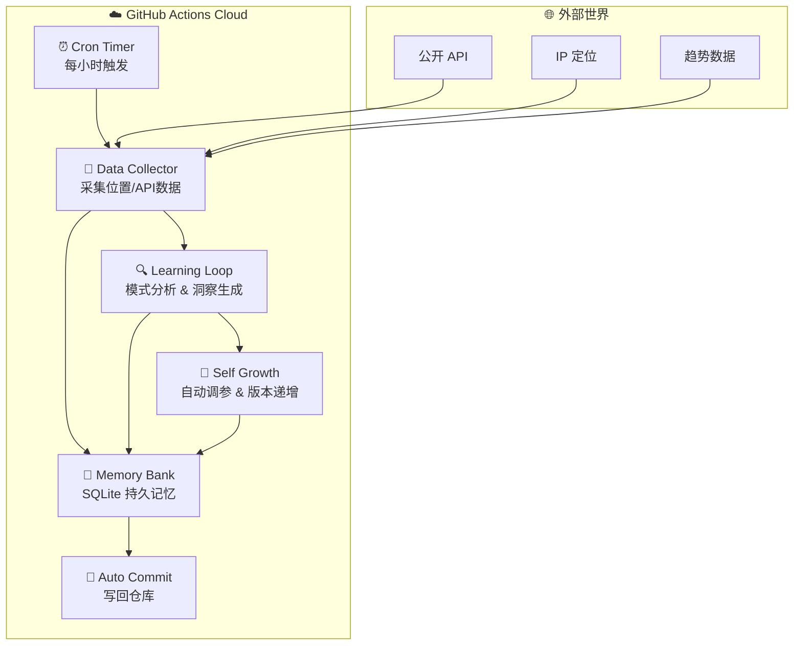
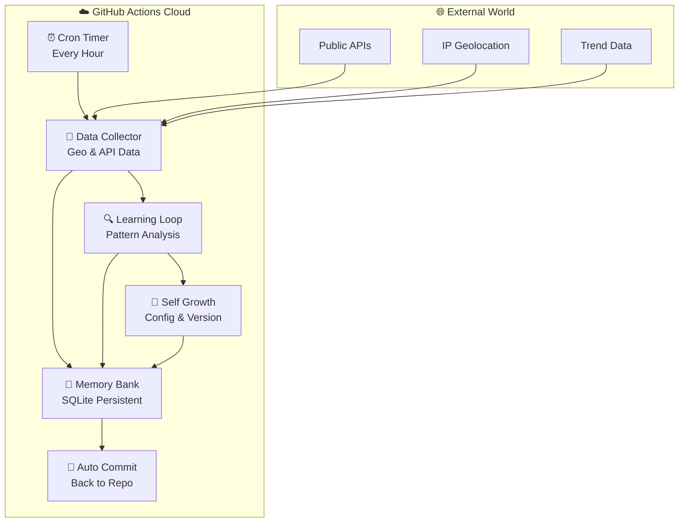

<p align="center">
  
  
  
</p>

<h1 align="center">🧬 Autonomous Agent</h1>
<p align="center"><strong>自循环进化智能体</strong> &nbsp;|&nbsp; <em>A Self-Growing, Self-Evolving AI Agent</em></p>

---

> **中文** | [English](#english)

---

## 🇨🇳 中文

### 🌌 这是什么？

**Autonomous Agent** 是一个**全自动运行**的 AI 智能体——不需要本地服务器、不需要手动触发、不需要人工干预。它部署在 **GitHub Actions** 云端，每小时自动唤醒，采集真实世界数据，构建持久记忆，分析模式规律，并自我调整参数持续进化。

> 它不问，它只管生长。

### ✨ 核心能力

| 模块 | 说明 |
|------|------|
| 📡 **数据采集** | 自动获取地理位置、公开 API、环境数据 |
| 🧠 **记忆银行** | 基于 SQLite 的持久化记忆，随每次循环增长 |
| 🔍 **学习循环** | 分析历史数据、检测模式、生成洞察 |
| 🌱 **自我增长** | 自动调参、版本递增、知识库扩充 |
| 🔄 **自动循环** | GitHub Actions 每小时触发，零人工介入 |
| 📝 **自动提交** | 每次洞察、配置变更、版本更新自动 commit 回仓库 |

### 🏗 架构图



### 🚀 快速开始

```bash
# 克隆仓库
git clone https://github.com/jincheng3870682453-hash/autonomous-agent.git
cd autonomous-agent
```

推送后，GitHub Actions 自动接管，无需任何额外配置。

**本地测试：**

```bash
pip install requests
python src/engine.py
```

### 📂 项目结构

```
autonomous-agent/
├── src/engine.py                 ← 核心引擎：记忆/学习/生长
├── memory/memory.db              ← 持久化知识库（自动增长）
├── data/                         ← 采集数据存档
├── .github/workflows/agent-cycle.yml  ← 云端定时调度
├── scripts/install.py            ← Skill 安装器
├── config.json                   ← 自我进化的配置
├── LICENSE                       ← MIT 许可证
└── README.md
```

---

## 🌐 English <a id="english"></a>

### 🌌 What Is This?

**Autonomous Agent** is a fully autonomous AI agent — no local server, no manual triggers, no human intervention. Deployed on **GitHub Actions**, it wakes every hour to collect real-world data, build persistent memory, analyze patterns, and self-evolve its parameters.

> It doesn't ask. It just grows.

### ✨ Core Capabilities

| Module | Description |
|--------|-------------|
| 📡 **Data Collector** | Auto-fetches geolocation, public APIs, environmental data |
| 🧠 **Memory Bank** | SQLite-backed persistent memory, growing with every cycle |
| 🔍 **Learning Loop** | Analyzes historical data, detects patterns, generates insights |
| 🌱 **Self Growth** | Auto-tunes parameters, increments version, expands knowledge |
| 🔄 **Auto Cycle** | GitHub Actions triggers hourly — zero human intervention |
| 📝 **Auto Commit** | Every insight, config change, and version bump committed back |

### 🏗 Architecture



### 🚀 Quick Start

```bash
git clone https://github.com/jincheng3870682453-hash/autonomous-agent.git
cd autonomous-agent
```

Once pushed, GitHub Actions takes over. No extra configuration needed.

**Local test:**

```bash
pip install requests
python src/engine.py
```

### 📂 Project Structure

```
autonomous-agent/
├── src/engine.py                 ← Core engine: memory, learning, growth
├── memory/memory.db              ← Persistent knowledge base (auto-growing)
├── data/                         ← Collected data archives
├── .github/workflows/agent-cycle.yml  ← Cloud cron scheduler
├── scripts/install.py            ← Skill installer
├── config.json                   ← Self-evolving configuration
├── LICENSE                       ← MIT License
└── README.md
```

---

## 📜 License

MIT © 2025 — Free to use, modify, and distribute.

---

<p align="center">
  <sub>🧬 Built for autonomous evolution</sub>
</p>
